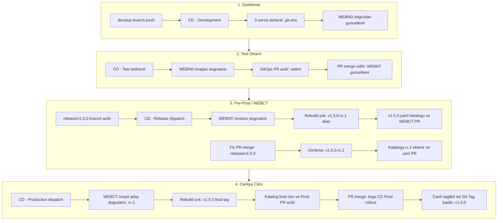

# Nexum CD GitOps Release ve Terfi Mimarisi

Bu dokuman, microservice uygulamalarinin Development ortamindan Production ortamina kadar nasil guvenli, izlenebilir ve sifir gereksiz derleme (zero rebuild) ile tasindigini aciklar. Dokuman, gercek test senaryomuz olan **v1.5.0** surumu uzerinden orneklenmistir.

---

## 1. Temel Mantik ve Mimari Akis

Mimarinin temel felsefesi sudur: **Kod yalnizca degistiginde derlenir; test edilen paket bir ust ortama tasinirken asla yeniden derlenmez, yalnizca registry seviyesinde etiketlenir (alias).**



---

## 2. GitOps Depo Yapisi (test-gitops)

Ortam degerleri ve surum tarihcesi GitOps deposunda su hiyerarsiyle yonetilir:

```text
nexum/
|-- argocd/
|   `-- environments/
|       |-- webnd/               # Gelistirme ortami (develop)
|       |   |-- webapp/values.yaml
|       |   |-- internalapi/values.yaml
|       |   `-- externalapi/values.yaml
|       |-- webnt/               # Test ortami
|       |   |-- webapp/values.yaml
|       |   |-- internalapi/values.yaml
|       |   `-- externalapi/values.yaml
|       |-- webct/               # Pre-prod / Candidate test ortami
|       |   |-- webapp/values.yaml
|       |   |-- internalapi/values.yaml
|       |   `-- externalapi/values.yaml
|       `-- prod/                # Production ortami
|           |-- webapp/values.yaml
|           |-- internalapi/values.yaml
|           `-- externalapi/values.yaml
`-- releases/
    |-- v1.0.0.yaml              # Sorumlu surum kataloglari
    `-- v1.5.0.yaml
```

---

## 3. Workflow'lar ve Sirayla Gorevleri

### 1. CD - Development (cd-development.yml)
* **Ne zaman calisir:** `develop` branch'ine kod pushlandiginda otomatik devreye girer.
* **Ne yapar:**
  1. `build-*` job'lari: `webapp`, `internalapi` ve `externalapi` servislerini derler ve imajlari `git-<short_sha>` (ornek: `git-ee06207a5cb9`) etiketiyle registry'ye basar.
  2. `deploy-webnd` job'i: GitOps deposundaki `webnd` klasorundeki `values.yaml` dosyalarini dogrudan `main`e commit atarak gunceller. PR acilmaz, katalog olusturulmaz.

### 2. CD - Test (cd-test.yml)
* **Ne zaman calisir:** Manuel (`workflow_dispatch`) tetiklenir.
* **Ne yapar:**
  1. `promote-webnd-to-webnt`: WEBND'deki imajlarin SHA256 digest'larini registry uzerinden dogrular.
  2. Asla yeniden derleme yapmaz; ayni imajlar icin GitOps deposunda WEBNT ortamini hedefleyen bir PR acar (`gitops/nexum-webnt-git-<sha>`).
  3. PR merge edildiginde WEBNT test ortami guncellenmis olur.

### 3. CD - Release (cd-release.yml)
Release sureci iki farkli tetikleyici ile calisir:

#### A. Ilk Aday (RC1) - workflow_dispatch
* **On kosul:** Gelistirici, WEBNT'de test edilip onaylanan commit uzerinden `release/v1.5.0` branch'ini acar ve pushlar.
* **Calistirma:** Workflow `version: 1.5.0` parametresiyle baslatilir.
* **Ne yapar:**
  1. `Validate release branch against WEBNT revision`: Olusturulan branch'in gercekten WEBNT'deki onayli commit ile eslestigini denetler. Yanlis commit'ten acildiysa durdurur.
  2. `deploy-initial-release-candidate`: WEBNT'deki mevcut imaj digest'larina `v1.5.0-rc.1` etiketini ekler (derleme yapmaz).
  3. `nexum/releases/v1.5.0.yaml` katalog dosyasini olusturur ve WEBCT ortamina deploy edilmek uzere GitOps PR'i acar (`gitops/nexum-webct-v1.5.0-rc.1`).

#### B. Aday Duzeltmeleri (RC2, RC3...) - pull_request
* **Ne zaman calisir:** `release/v1.5.0` branch'ine bir fix PR'i merge edildiginde otomatik calisir.
* **Ne yapar:**
  1. Siradaki adayi hesaplar (`v1.5.0-rc.2`).
  2. Degisen koddan dolayi imajlari derler ve `v1.5.0-rc.2` olarak etiketler.
  3. `v1.5.0.yaml` katalogundaki `candidates` dizisine `rc.2`'yi ekler (`rc.1` korunur) ve `activeCandidate: v1.5.0-rc.2` yapar.
  4. WEBCT icin yeni bir PR acar (`gitops/nexum-webct-v1.5.0-rc.2`).

### 4. CD - Production (cd-production.yml)
* **Ne zaman calisir:** `main` branch'inden manuel (`workflow_dispatch`) tetiklenir (`version: 1.5.0`).
* **Ne yapar:**
  1. `finalize-release`: WEBCT ortaminda fiilen calisan adayin `v1.5.0.yaml` katalogundaki `activeCandidate` (`v1.5.0-rc.2`) ile eslestigini kontrol eder. Baska bir surum varsa durdurur.
  2. `deploy-production`: Onayli digest'lara `v1.5.0` final etiketini basar (rebuild yapmaz). Katalog durumunu `status: final` yapar ve `final:` kaydini doldurur. Prod GitOps PR'ini acar (`gitops/nexum-prod-v1.5.0`).
  3. `complete-production`: Argo CD Prod ortaminda deployment'i tamamlayip saglikli (`Healthy`) raporladiginda calisir; kaynak depodaki ilgili commit'e resmi `v1.5.0` Git Tag'ini basar.

### 5. CD - Hotfix (cd-hotfix.yml)
* **Ne zaman calisir:** `main` branch'ine `hotfix/v1.5.1-*` isimli bir PR merge edildiginde tetiklenir.
* **Ne yapar:**
  1. `metadata`: Branch adindan `v1.5.1` surumunu regex ile alir.
  2. `build-*`: Acil duzeltme kodunu derler ve `v1.5.1` olarak etiketler.
  3. `deploy-production`: Kataloga dogrudan `final` olarak yazar (`candidates` bos kalir) ve Prod PR'i acar.
  4. `backport`: Ayni hatanin gelecekte tekrar etmemesi icin `develop` ve aktif `release/*` branch'lerine otomatik PR acar.

---

## 4. Surum Katalog Yapisi Ornegi (v1.5.0.yaml)

Her semantic surumun GitOps icinde tek ve bagimsiz bir katalog dosyasi bulunur. Ornek uzerinden olusan son durum:

```yaml
version: v1.5.0
status: final
activeCandidate: v1.5.0-rc.2
createdAt: "2026-10-02T11:27:25Z"
updatedAt: "2026-10-02T11:45:00Z"
candidates:
  - id: v1.5.0-rc.1           # Ilk aday (WEBNT'den terfi eden)
    createdAt: "2026-10-02T11:27:25Z"
    source:
      branch: release/v1.5.0
      revision: ee06207a5cb9a6652e3e0acd9b78e1284f4b55b3
    services:
      webapp:
        tag: v1.5.0-rc.1
        digest: sha256:1891710ac33...
  - id: v1.5.0-rc.2           # Ikinci aday (Fix PR'i ile derlenen)
    createdAt: "2026-10-02T11:38:09Z"
    source:
      branch: release/v1.5.0
      revision: b236fcac71be5ac1e79085b3af6b2e993a407e83
    services:
      webapp:
        tag: v1.5.0-rc.2
        digest: sha256:e8020805c7c...
final:
  id: v1.5.0                  # Canliya cikan onayli son kayit
  createdAt: "2026-10-02T11:45:00Z"
  source:
    branch: release/v1.5.0
    revision: b236fcac71be5ac1e79085b3af6b2e993a407e83
  services:
    webapp:
      tag: v1.5.0
      digest: sha256:e8020805c7c...
```
